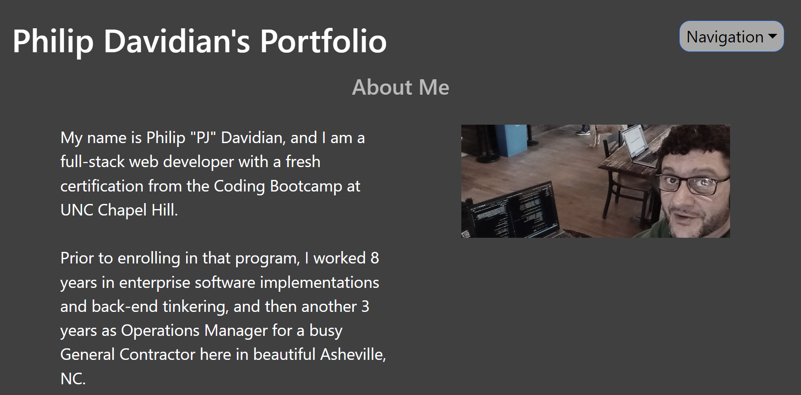

# React Portfolio

## Description

This Development Portfolio was built using React.js components to render different component views, as a homework challenge for the Coding Bootcamp at UNC Chapel Hill.

While it doesn't yet contain all of the components listed in the Acceptance Criteria, I did get the most important sections to render and spent a good deal of time getting the deployment to GitHub Pages working properly.

I plan to come back and finish fleshing this out to use as my primary online portfolio for job searches in the near future.

## Installation

To load this program on your computer, simply navigate to the deployed app on GitHub Pages at the following URL:

https://peejd.github.io/PJD_React_Portfolio/

## Usage

After loading the app at the above URL, follow these steps to use the app and see its functionality:

1 - Click the Navigation dropdown at top-right to view either the About Me section, or the Porfolio page containing cards that link to my past projects.

## Appearance

The following image shows the application's appearance:

## License

MIT License

Copyright (c) 2023 Peej D

Permission is hereby granted, free of charge, to any person obtaining a copy
of this software and associated documentation files (the "Software"), to deal
in the Software without restriction, including without limitation the rights
to use, copy, modify, merge, publish, distribute, sublicense, and/or sell
copies of the Software, and to permit persons to whom the Software is
furnished to do so, subject to the following conditions:

The above copyright notice and this permission notice shall be included in all
copies or substantial portions of the Software.

THE SOFTWARE IS PROVIDED "AS IS", WITHOUT WARRANTY OF ANY KIND, EXPRESS OR
IMPLIED, INCLUDING BUT NOT LIMITED TO THE WARRANTIES OF MERCHANTABILITY,
FITNESS FOR A PARTICULAR PURPOSE AND NONINFRINGEMENT. IN NO EVENT SHALL THE
AUTHORS OR COPYRIGHT HOLDERS BE LIABLE FOR ANY CLAIM, DAMAGES OR OTHER
LIABILITY, WHETHER IN AN ACTION OF CONTRACT, TORT OR OTHERWISE, ARISING FROM,
OUT OF OR IN CONNECTION WITH THE SOFTWARE OR THE USE OR OTHER DEALINGS IN THE
SOFTWARE.